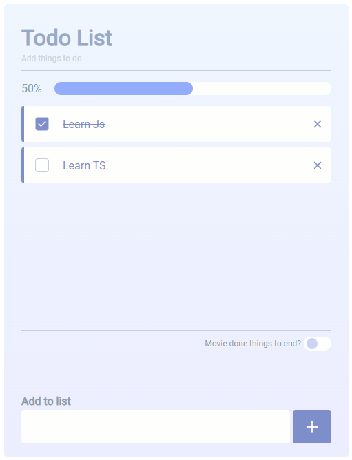

# Todo List

### 此專案使用 React (create-react-app) 以及 Firebase-database 實作 Todo List 的 CRUD，並部屬至 Vercel。

網址：https://todolist-sat.vercel.app/



## 規格說明

- 輸入 Todo：於輸入框內輸入文字，按下"+"按鈕後新增 Todo，練表中的 Todo 依加入時間排序(新的往下排);當新的 Todo 加入後滾動條滾至最下方；當新的 Todo 尚未加入完成時，"+"按鈕不可點擊。
- 獲取所有 Todos：進入 APP 後獲取所有項目，並依時間排序(新的往下排)；單筆 Todo 內容過長時，超過的文字以"..."呈現，滑鼠移至項目上時，展開全部內容。
- 完成 Todo：點擊列表中的勾選框，勾選框呈現"打勾"和文字標示"刪除線"。
- 刪除 Todo：點擊"X"按鈕後，刪除該 Todo。
- 滾動條：以側邊滾動條滾動瀏覽更多項目。
- 進度條：已完成 Todo 的完成率，以整數位百分比呈現。
- 切換紐：可點擊進行切換，當打開時，已完成的 Todo 排列至列表下方，未完成的 Todo 排列至列表上方；當關閉時，恢復依時間排序(新的往下排)。

## 開發工具

<p align="center">
  <a href="https://skillicons.dev">
    
  </a>
</p>

- React v.18.2.0
- Firebase v.9.21.0
- SaSS v.1.62.1
- 部屬至 Vercel

## 使用專案

<h3>因本專案使用 Firebase 資料庫，故建議前往部屬網址使用專案。
<a href="https://todolist-sat.vercel.app/">https://todolist-sat.vercel.app/</a>
</h3>

<br/>

### 本地使用專案 (無資料庫服務)

- clone 專案

```
git clone https://github.com/LoisChen68/careerforum.git
```

- npm 安裝

```
npm i
```

- 啟動伺服器 (運行於：http://localhost:3000/)

```
npm run start
```
